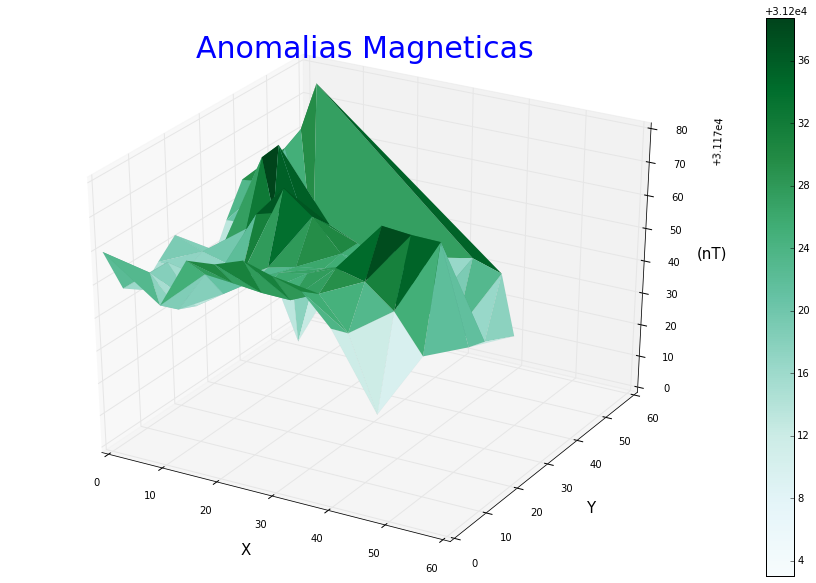
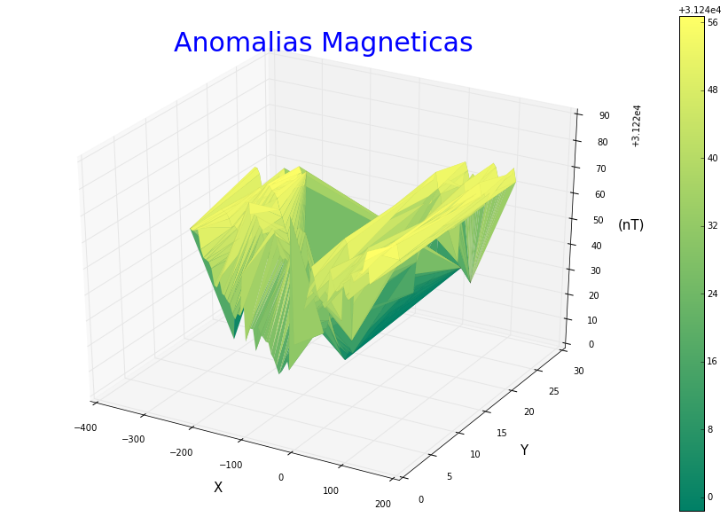
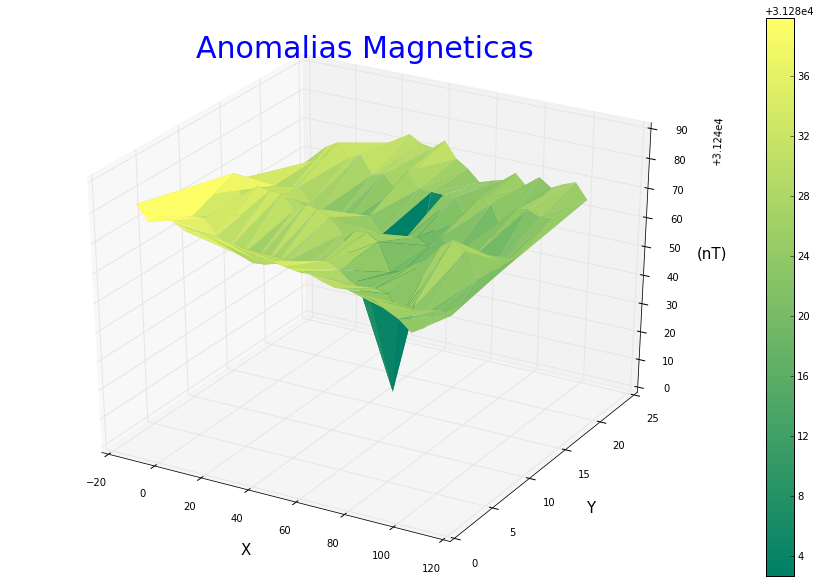
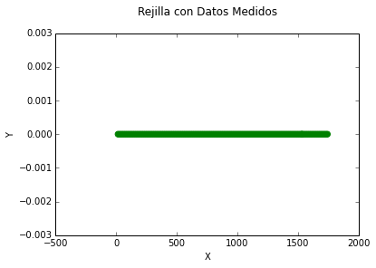
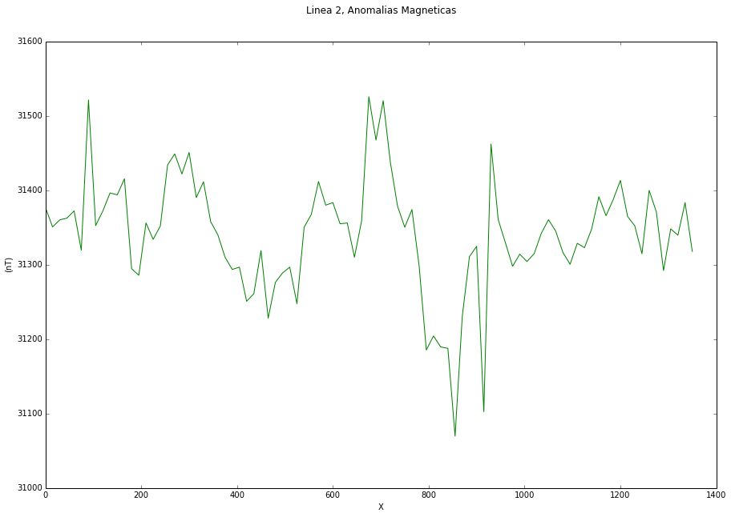

# HERRAMIENTAS COMPUTACIONALES 21-05-2015 PROYECTO - HW12 ANDRES RODRIGUEZ - CAMILO ARENAS - DAVID CRISTANCHO

En este proyecto queremos usar las herramientas aprendidas durante el semestre y aplicarlas en una de las ramas de nuestra carrera (Geociencias), recolectamos datos propios de una salida de campo en el Departamento del Tolima, para analizarlos. LOs datos fueron tomados por diferentes grupos de compañeros que tomaron tambien el curso de Geofisica, cada grupo estudio distintas zonas.

#La Magnetometria es un estudio de la Geofisica que busca medir las variaciones del campo magnetico terrestre de una zona determinada. Aquellas variaciones, son debidas a la presencia de cuerpos subterraneos que pueden ser magnetizados, los cuales pueden modificar el campo magnético terrestre en una zona determinada. ESte metodo es usado en la exploracion geologica y minera, en el estudio del suelo y de objetos enterrados (minas-arqueologia).

#El objetivo del proyecto es graficar los datos obtenidos, para observar una correlacion entre el espacio (dimensional) y las anomalias del campo magnetico.

#Las lineas de medicion corresponden a distintas mediciones en una misma zona, la priemra grafica de cada medicion muestra el recorrido espacial que hicimos con el instrumento de medicion, mientras que las graficas en 3D son la correlacion.

#El instrumento de medicion usado fue el "magnetometro".

    #Librerias necesarias para el desarrollo del programa
    from mpl_toolkits.mplot3d import Axes3D
    from StringIO import StringIO
    %pylab inline 

    Populating the interactive namespace from numpy and matplotlib

##     Grupo I

Estas mediciones gravimetricas se realizaron en un terreno que no era completamente llano, por lo cual se presume que existiran algunos errores en la grilla creada. La orientacion de esta grilla fue W-E. 

Las coordenadas aproximadas de este lugar son:

Coordenadas entrada potrero: 
                             
                             5°7'18.8" N      (Precision + o - 3m).
                             74°56'4.38 W
 
                             5°7'18.65" N     (Precision + o - 3m).
                             74°56'4.35 W

                             5°7'18.6" N      (Precision + o - 3m).
                             74°56'4.49 W

    #Carga de datos y grafica de la rejilla
    datos=loadtxt("Grupo_I.txt")
    X=datos[:,0]
    Y=datos[:,1]
    Z=datos[:,2]
    
    scatter(X,Y,color="g",s=40)
    plt.xlabel('X')
    plt.ylabel('Y')
    plt.title('Rejilla con Datos Medidos\n')

    <matplotlib.text.Text at 0x9f5f438>

Esta es la rejilla recolectada por el Magnetómetro, podemos ver que no esta completa, sin embargo, tiene una forma mas o menos coherente y se puede extraer información de esta. Datos con valores de campo magnetico igual a cero o nulos fueron omitidos para tener una analisis mas preciso.

    #Generacion de la superficie "triangular" 3D, existian problemas con otro tipo de superficies
    grafica = plt.figure(figsize=(16,10))
    draw1 = grafica.gca(projection='3d')
    
    map=draw1.plot_trisurf(X,Y,Z, cmap=cm.get_cmap('BuGn'), linewidth=0.01)
    c2 = grafica.colorbar(map)
    draw1.set_xlabel('X', fontsize=15)
    draw1.set_ylabel('Y', fontsize=15)
    draw1.set_zlabel('(nT)', fontsize=15)
    draw1.set_title('Anomalias Magneticas',fontsize=30,color='b')

    C:\Anaconda\lib\site-packages\matplotlib\delaunay\triangulate.py:104: DuplicatePointWarning: Input data contains duplicate x,y points; some values are ignored.
      DuplicatePointWarning,

    <matplotlib.text.Text at 0xa1ce8d0>

Podemos observar que en nuestra grafica de anomalias magneticas la distribucion de la variacion del campo magnetico es muy abrupta en dos puntos, debido a que para los Y menores esta es negativa y para los Y mayores esta es muy positiva. Geologicamente estas anomalias pueden estar asociadas a la presencia del basamento metamorfico sobre el cual yacen las rocas sedimentarias en las cuales se realizo esta prospeccion magnetometrica, sin embargo, no se espera la presencia de ningun yacimiento mineral ya que estos picos pueden estar exagerados por interferencias u otras fuentes de error, debido a que solo se observan 2 puntos de anomalia.

# Grupo A

Para este grupo tenemos dos grupos de datos. Para los cuales tenemos dos conjuntos de datos diferentes, dos grillas y anomalias diferentes.

Las coordenadas de los lugares de medicion son:

Datos 1-
          
          Coordenadas: 4°58'39''N 
          
                       74°54'42''W

Datos 2-

          Coordenadas: 4°59'31''N 
                       74°54'56''W

# Linea 1:

    #Carga de datos y grafica de la rejilla
    datos=loadtxt("Grupo_A1.txt")
    X1=datos[:,0]
    Y1=datos[:,1]
    Z1=datos[:,2]
    
    scatter(X1,Y1,color="g",s=40)
    plt.xlabel('X')
    plt.ylabel('Y')
    plt.title('Rejilla con Datos Medidos\n')

    <matplotlib.text.Text at 0x145cccc0>

Podemos observar que esta rejilla es casi perfecta, al tener el resultado de esta podremos tener informacion valiosa y completa acerca de todo el terreno medido. En este caso los valores para el campo magnetico medido son mas o menos uniformes y no fue necesaria la eliminacion de ningun dato.

    #Generacion de la superficie "triangular" 3D, existian problemas con otro tipo de superficies
    grafica = plt.figure(figsize=(16,10))
    draw1 = grafica.gca(projection='3d')
    
    map=draw1.plot_trisurf(X1,Y1,Z1, cmap=cm.get_cmap('summer'), linewidth=0.01)
    c2 = grafica.colorbar(map)
    draw1.set_xlabel('X', fontsize=15)
    draw1.set_ylabel('Y', fontsize=15)
    draw1.set_zlabel('(nT)', fontsize=15)
    draw1.set_title('Anomalias Magneticas',fontsize=30,color='b')

    <matplotlib.text.Text at 0x14e3ac88>

Podemos observar un patron extremadamente plano en casi toda la rejilla a excepcion de un punto en especifico, esto podria significar la presencia de una caracteristica geologica muy local, como una fraccion del basamento equivalente a esta zona que una vez afloro antes de ser cubierto por la secuencia sedimentaria.

# Linea 2:

    #Carga de datos y grafica de la rejilla
    datos=loadtxt("Grupo_A2.txt")
    XA2=datos[:,0]
    YA2=datos[:,1]
    ZA2=datos[:,2]
    
    scatter(XA2,YA2,color="g",s=40)
    plt.xlabel('X')
    plt.ylabel('Y')
    plt.title('Rejilla con Datos Medidos\n')

    <matplotlib.text.Text at 0xb8dcd30>

Podemos observar que esta rejilla tiene algunos problemas, debido a que seguramente en el momento de la prospeccion no se detuvo el medidor en el momento de parar cada cierta distancia, por lo que observamos lineas continuas. Sin embargo, debido a que tenemos varias lineas de la misma zona es posible extraer algo de informacion acerca de esta zona.

    #Generacion de la superficie "triangular" 3D, existian problemas con otro tipo de superficies
    grafica = plt.figure(figsize=(16,10))
    draw1 = grafica.gca(projection='3d')
    
    map=draw1.plot_trisurf(XA2,YA2,ZA2, cmap=cm.get_cmap('summer'), linewidth=0.01)
    c2 = grafica.colorbar(map)
    draw1.set_xlabel('X', fontsize=15)
    draw1.set_ylabel('Y', fontsize=15)
    draw1.set_zlabel('(nT)', fontsize=15)
    draw1.set_title('Anomalias Magneticas',fontsize=30,color='b')

    <matplotlib.text.Text at 0xbafcdd8>

Debido a que hay muchos huecos en la rejilla, podemos decir que este terreno de prospeccion tiene patrones casi completamente planos, por 
lo que es presumible que las rocas de esta zona tienen una susceptibilidad magnetica muy homogenea. De la misma forma, es posible mencionar
que en puntos donde hay mediciones y hay anomalias positivas podrian ser lugares donde el basamento igeno o metamorfico aflora.

# Linea 3:

    #Carga de datos y grafica de la rejilla
    datos=loadtxt("Grupo_A3.txt")
    XA3=datos[:,0]
    YA3=datos[:,1]
    ZA3=datos[:,2]
    
    scatter(XA3,YA3,color="g",s=40)
    plt.xlabel('X')
    plt.ylabel('Y')
    plt.title('Rejilla con Datos Medidos\n')

    <matplotlib.text.Text at 0xbfd8710>

Esta grilla esta casi completa en cuanto a datos de anomalias magneticas se refiere. Por lo cual posee informacion magnetometrica muy completa de la zona.

    #Generacion de la superficie "triangular" 3D, existian problemas con otro tipo de superficies
    grafica = plt.figure(figsize=(16,10))
    draw1 = grafica.gca(projection='3d')
    
    map=draw1.plot_trisurf(XA3,YA3,ZA3, cmap=cm.get_cmap('summer'), linewidth=0.01)
    c2 = grafica.colorbar(map)
    draw1.set_xlabel('X', fontsize=15)
    draw1.set_ylabel('Y', fontsize=15)
    draw1.set_zlabel('(nT)', fontsize=15)
    draw1.set_title('Anomalias Magneticas',fontsize=30,color='b')

    <matplotlib.text.Text at 0xc17e6d8>

Podemos observar un patron de anomalias magneticas casi plano, a excepcion de un punto en general donde se da una anomalia negativa. Posiblemente por la presencia de un tipo de roca de composicion diferente pero muy local, un lente posiblemente.

## Grupo E

Para este grupo existe un problema a la hora de correlacionar los datos medidos con la geologia regional, debido a que hasta el momento no se saben cuales son las coordenadas exactas de estas zonas de medicion, ya que se realizaron aproximadamente 4 lineas.

# Linea 1:

    #Carga de datos y grafica de la rejilla
    datos=loadtxt("e1.txt")
    XE1=datos[:,0]
    YE1=datos[:,1]
    ZE1=datos[:,2]
    
    scatter(XE1,YE1,color="g",s=40)
    plt.xlabel('X')
    plt.ylabel('Y')
    plt.title('Rejilla con Datos Medidos\n')

    <matplotlib.text.Text at 0xc51c9e8>

Podemos observar que esta grilla esta muy bien hecha por lo que se esperan datos confiables acerca de la zona de la medicion, asi como graficas coherentes.

    #Generacion de la superficie "triangular" 3D, existian problemas con otro tipo de superficies
    grafica = plt.figure(figsize=(16,10))
    draw1 = grafica.gca(projection='3d')
    
    map=draw1.plot_trisurf(XE1,YE1,ZE1, cmap=cm.get_cmap('BuGn'), linewidth=0.01)
    c2 = grafica.colorbar(map)
    draw1.set_xlabel('X', fontsize=15)
    draw1.set_ylabel('Y', fontsize=15)
    draw1.set_zlabel('(nT)', fontsize=15)
    draw1.set_title('Anomalias Magneticas',fontsize=30,color='b')

    <matplotlib.text.Text at 0xdbfa828>

Las variaciones en el campo magnetico de esta grafica son casi insignificantes, sin embargo, a fin de observar a mas detalle el comportamiento de las anomalias el eje Z esta exagerado. Por esta razon podemos concluir que la suceptibilidad magnetica de esta zona es muy uniforme.

# Linea 2:

    #Carga de datos y grafica de la rejilla
    datos=loadtxt("e2.txt")
    XE2=datos[:,0]
    YE2=datos[:,1]
    ZE2=datos[:,2]
    
    scatter(XE2,YE2,color="g",s=40)
    plt.xlabel('X')
    plt.ylabel('Y')
    plt.title('Rejilla con Datos Medidos\n')

    <matplotlib.text.Text at 0xdfa3b00>

Esta rejilla corresponde solo a una linea, por lo que la informacion que da acerca de la suceptibilidad magnetica del terreno es insignificante. Ademas, debido a que es solo una linea, presenta problemas a la hora de generar la respectiva superficie por lo cual no se mostrara.

    plt.figure(figsize=(15, 10))
    plt.plot(XE2,ZE2,color='g')
    plt.title('Linea 2, Anomalias Magneticas \n\n')
    plt.xlabel('X')
    plt.ylabel('(nT)')

    <matplotlib.text.Text at 0xe01c048>

En esta ocasion se realizo una grafica de distancia horizontal vs variacion en campo magnetico, debido a que se realizo una medicion en linea recta en este survey gravimetrico. Podemos observar un comportamiento casi completamente plano a excepcion de algunas anomalias con valor de cero que pueden ser resultado de rocas con susceptibilidad magnetica muy baja o errores en el survey.

# Linea 3:

    #Carga de datos y grafica de la rejilla
    datos=loadtxt("e3.txt")
    XE3=datos[:,0]
    YE3=datos[:,1]
    ZE3=datos[:,2]
    
    scatter(XE3,YE3,color="g",s=40)
    plt.xlabel('X')
    plt.ylabel('Y')
    plt.title('Rejilla con Datos Medidos\n')

    <matplotlib.text.Text at 0xe3550b8>

d

    #Generacion de la superficie "triangular" 3D, existian problemas con otro tipo de superficies
    grafica = plt.figure(figsize=(16,10))
    draw1 = grafica.gca(projection='3d')
    
    map=draw1.plot_trisurf(XE3,YE3,ZE3, cmap=cm.get_cmap('summer'), linewidth=0.01)
    c2 = grafica.colorbar(map)
    draw1.set_xlabel('X', fontsize=15)
    draw1.set_ylabel('Y', fontsize=15)
    draw1.set_zlabel('(nT)', fontsize=15)
    draw1.set_title('Anomalias Magneticas',fontsize=30,color='b')

    <matplotlib.text.Text at 0xe436358>

Para esta prospeccion magnetometrica podemos observar que los datos de campo magnetonico son casi absolutamente planos a excepcion de un solo punto que tiene una anomalia de 0, por lo cual puede deberse a una caracteristica geologica absolutamente local. Sin embargo, no podemos ir mas alla de lo mencionado, ya que no tenemos la localizacion de esta zona de medicion.

# Linea 4:

    #Carga de datos y grafica de la rejilla
    datos=loadtxt("e4.txt")
    XE4=datos[:,0]
    YE4=datos[:,1]
    ZE4=datos[:,2]
    
    scatter(XE4,YE4,color="g",s=40)
    plt.xlabel('X')
    plt.ylabel('Y')
    plt.title('Rejilla con Datos Medidos\n')

    <matplotlib.text.Text at 0xe883e10>

Al igual que ocurre con la linea dos de este grupo, esta linea 4 no es una rejilla lo que implica que la informacion recopilada es casi insignificante, ademas, no tenemos geologia de este lugar para contrastar los resultados por lo que esta linea no nos da ningun tipo de informacion. De la misma forma, no es posible obtener una superficie 3D con estos datos.

    plt.figure(figsize=(15, 10))
    plt.plot(XE4,ZE4,color='g')
    plt.title('Linea 2, Anomalias Magneticas \n\n')
    plt.xlabel('X')
    plt.ylabel('(nT)')

    <matplotlib.text.Text at 0xe9f88d0>

En esta grafica de Distancia Horizontal vs Campo Magnetico podemos observar que se dan variaciones en el campo magnetico muy significativas a lo largo de toda la linea de prospeccion, con cuatro picos muy marcados (uno positivo y uno negativo)por lo cual podria existir una caracteristica geologica interesante en las cercanias, sin embargo, esta interpretacion queda abierta debido a que no se realizo una rejilla efectiva.

# Grupo H:

Este grupo realizo una sola rejilla, por lo cual el analisis geologico de la zona se limitara exclusivamente a un solo cuadrante.

Coordenadas:

             4º59'38.24''N 
             74º54'48.73''W

    #Carga de datos y grafica de la rejilla
    datos=loadtxt("GrupH.txt")
    XH=datos[:,0]
    YH=datos[:,1]
    ZH=datos[:,2]
    
    scatter(XH,YH,color="g",s=40)
    plt.xlabel('X')
    plt.ylabel('Y')
    plt.title('Rejilla con Datos Medidos\n')

    <matplotlib.text.Text at 0x1064a9b0>

Esta rejilla esta muy bien construida por lo que los datos de anomalias derivados de esta (si se dan cambios significativos) pueden dar informacion muy util acerca de ciertos contrastes que determinan la geologia de la zona en la cual esta ubicada este terreno.

    #Generacion de la superficie "triangular" 3D, existian problemas con otro tipo de superficies
    grafica = plt.figure(figsize=(16,10))
    draw1 = grafica.gca(projection='3d')
    
    map=draw1.plot_trisurf(XH,YH,ZH, cmap=cm.get_cmap('summer'), linewidth=0.01)
    c2 = grafica.colorbar(map)
    draw1.set_xlabel('X', fontsize=15)
    draw1.set_ylabel('Y', fontsize=15)
    draw1.set_zlabel('(nT)', fontsize=15)
    draw1.set_title('Anomalias Magneticas',fontsize=30,color='b')

    <matplotlib.text.Text at 0x108bc048>

En esta grafica fue necesario cambiar la escala de colores que se habia manejado hasta el momento porque deja de lado gran parte de la informacion medida. Despues de esto podemos observar que la gran mayoria de los datos tienen un comportamiento plano a excepcion de unos cuantos datos en el borde de la rejilla, esto puede ser a causa de que los datos fueron medidos sobre una cobertura sedimentaria emplazada en un basamento metamorfico (este basamento fue observado por el survey de gravimetria el dia de la medicion). Estas rocas podrian corresponder al Complejo Cajamarca.

    ###Este proyecto fue modificado de un trabajo entregado para la clase de Geofisica dictada el segundo semestre de 2014.
